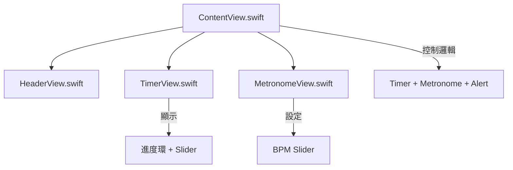

# 🏃‍♂️ SlowJoggingTimer App
一款專為 超慢跑訓練 設計的 iOS App，結合 計時器、節拍器 與 運動提醒，幫助使用者保持穩定步頻並完成運動目標。

## 📌 基本資訊
作者：陳憶柔

學號：D1204387

專案名稱：SlowJoggingTimer

## 📱 專案簡介

本專案為一款 超慢跑計時器 App，結合 計時器 與 節拍器，幫助使用者維持穩定步頻並完成運動目標。

App 具有簡潔 UI，提供 目標時間提醒（震動 + 提示音 + Alert）與 節奏控制。

## 📱 主要功能特色

🕒 智慧計時器

可設定目標時間（ 1 〜 60 分鐘）

以 圓形進度環 直觀顯示運動進度

完成目標時間 → 震動 + 提示音 + Alert 提醒

🎵 內建節拍器

支援 BPM（ 120 〜 240 BPM）調整

運行時自動播放「滴答」聲幫助維持步頻

🎨 簡潔藍灰 UI

採用 藍/灰漸層 與 卡片風格

動態進度顏色（完成時變綠色）

符合 Apple Fitness 風格

## 🏗 架構圖


🔹 說明：
ContentView 是 主控制中心，負責計時與節拍器邏輯，以及觸發 Alert 提醒。

TimerView 負責 顯示計時進度環 與 設定目標時間。

MetronomeView 提供 BPM 調整 介面。

HeaderView 只負責 App 標題與 UI 裝飾。

## 🖼️ App 介面截圖

| **計時畫面** | **完成提醒** | **BPM 設定** |
|--------------|-------------|--------------|
| [Timer](Screenshots/Timer.png) | [Alert](Screenshots/Alert.png) | [Metronome](Screenshots/Metronome.png) |

## 🧩 檔案結構
```plaintext

SlowJoggingTimer/
├── ContentView.swift      # 主控制邏輯 + Alert + Timer/Metronome 整合
├── TimerView.swift        # 進度環顯示 + 目標時間 Slider
├── MetronomeView.swift    # BPM Slider + 卡片 UI
├── HeaderView.swift       # App 標題 + 漸層裝飾
├── Assets.xcassets/       # App 圖示與顏色資源
└── README.md              # 專案說明
```

## 🏗 技術架構

語言：Swift 5 + SwiftUI

架構：組件化設計（Header / Timer / Metronome）

系統音效：AudioToolbox（提示音 & 震動）

計時功能：Timer API

節拍器：支援系統滴答聲（可擴充 tick.wav）

## ✅ 如何使用

Clone / 下載此專案

使用 Xcode 14+ / 15+ / 16+ 開啟

在模擬器或 iPhone 上執行

設定目標時間 → 點擊「開始」 → 享受超慢跑！

## 🔮 未來改進

✅ 支援 tick.wav 自訂滴答聲

✅ 增加 運動歷史紀錄（保存每次完成結果）

✅ 完成時顯示 Pulse 動畫特效

✅ 匯出資料（CSV / 健康 App 整合）

## 👨‍💻 開發者資訊

姓名：YiJou Chen (陳憶柔)

📅 開發日期：2025 / 08 / 03